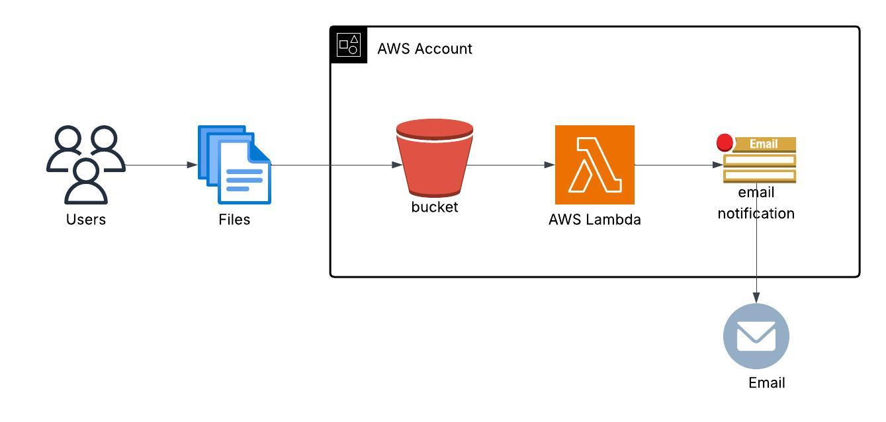

# 📦 AWS S3 Lambda SNS Email Notification Project

This project demonstrates how to build an event-driven serverless architecture using **Terraform**, **AWS Lambda**, **Amazon S3**, and **Amazon SNS** to automatically notify users via email when files are uploaded to an S3 bucket.

---

## Architecture Diagram



---

## Use Case

- Users upload files (e.g., reports, images) to an S3 bucket.
- The S3 bucket triggers a Lambda function.
- The Lambda function (written in Python using `boto3`) sends a message to an SNS topic.
- SNS forwards that message as an email notification to all subscribed addresses.

---

## Technologies Used

- **Terraform** — Infrastructure as Code
- **AWS S3** — Scalable object storage
- **AWS Lambda** — Serverless compute
- **AWS SNS** — Email notification service
- **Python (boto3)** — AWS SDK for Lambda function logic

---

## Lambda Function Overview (`lambda/lambda_function.py`)

```python
import json
import boto3
import os

sns = boto3.client('sns')
sns_topic_arn = os.environ['SNS_TOPIC_ARN']

def lambda_handler(event, context):
    try:
        bucket = event["Records"][0]["s3"]["bucket"]["name"]
        key = event["Records"][0]["s3"]["object"]["key"]

        message = f"A new object has been uploaded to S3:\n\nBucket: {bucket}\nKey: {key}"
        subject = "New S3 Upload Notification"

        sns.publish(
            TopicArn=sns_topic_arn,
            Message=message,
            Subject=subject
        )

        return {
            "statusCode": 200,
            "body": json.dumps("SNS notification sent successfully.")
        }

    except Exception as e:
        return {
            "statusCode": 500,
            "body": json.dumps(f"Error: {str(e)}")
        }
```

The Lambda function uses boto3 to send messages to SNS.
The SNS_TOPIC_ARN is securely passed through environment variables defined in Terraform.


---

## Deployment Instructions

1. Prerequisites
- AWS CLI configured (aws configure)
- Terraform installed (brew install terraform or download)
- Valid AWS credentials with permission to manage S3, Lambda, and SNS
  
2. Clone the repo
```bash
git clone [https://github.com/s-oa18/terraform-s3-lambda-sns-email.git]
cd terraform-s3-lambda-sns-email

```

3. Set your email in terraform.tfvars
```bash
email_address = "you@example.com"

```

### 4.  Initialize Terraform
```bash
terraform init

```

### 5. Deploy the infrastructure
```bash
terraform plan
terraform apply
```
✅ Check your email inbox to confirm the SNS subscription.

## Test the Setup

Upload any file to the created S3 bucket:

You should receive an email like:
```bash
A new object has been uploaded to S3:
Bucket: The-bucket-name
Key: file name

```

## Clean Up

To destroy all resources:
```bash
terraform destroy

```
